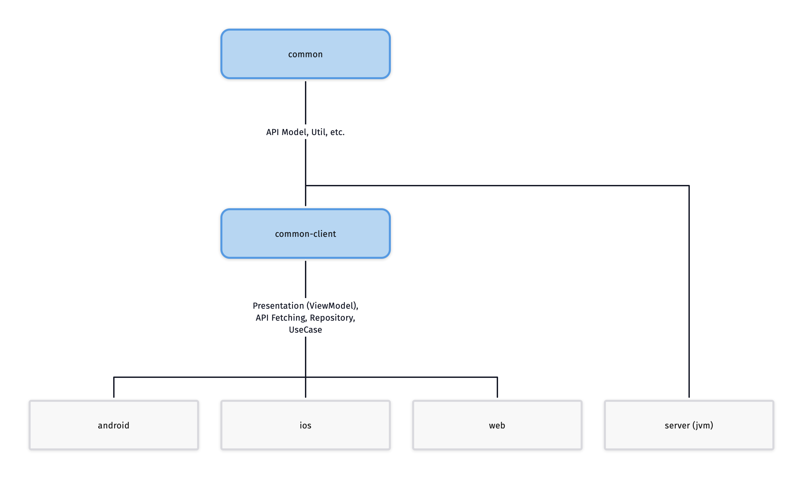

# 선인장 (선택장애 인간들을 위한 장) 프로젝트

## Project Architecture Overall

### Diagram

### Concept
#### Kotlin Multiplatform
- Supports android, ios, web, server (jvm)

## Common Client Side Architecture Overall

### Diagram

### Concept
#### Clean Architecture Pattern
- data, domain, presentation (viewmodel) layer 를 `common-client` package 에 구분합니다.

#### Uni-Directional Architecture (UDA) 구조
- [UDA 란?](https://proandroiddev.com/unidirectional-data-flow-on-android-the-blog-post-part-1-cadcf88c72f5)
- State, Event, Effect 구조를 ViewModel 에 적용합니다.
- Event 를 사용하여 ViewModel 에 특정 이벤트를 전송합니다.
- Event 등에 따라 각 UseCase 에서 받은 데이터를 Reducer 개념을 사용하여 하나의 State 로 Merge 한 후에 UI 에 전달합니다.

#### ViewModel 로 같은 UI 렌더링 로직 공유
- 클라이언트는 화면별로 viewmodel 을 갖고 있으며, 각 플랫폼은 모두 같은 viewmodel 로직을 공유합니다.
